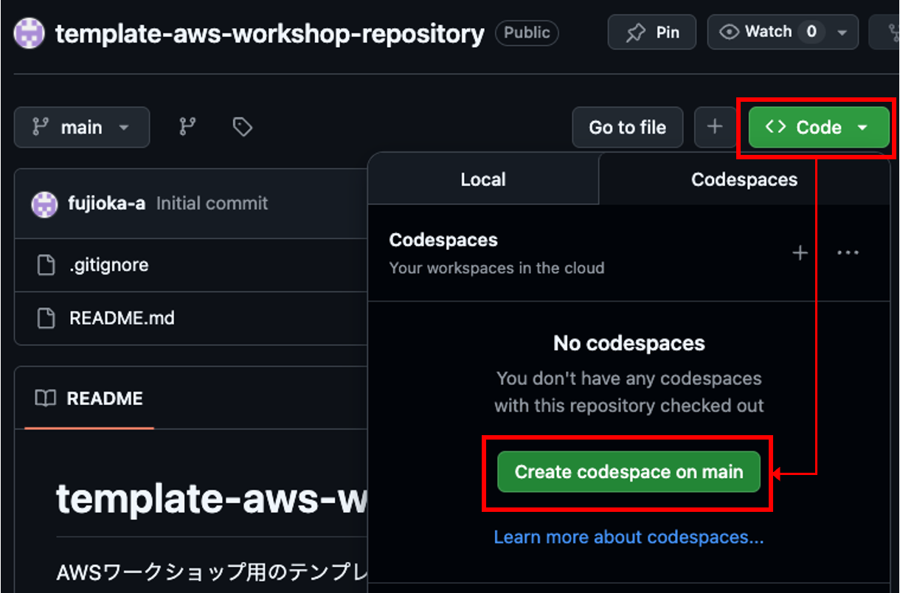
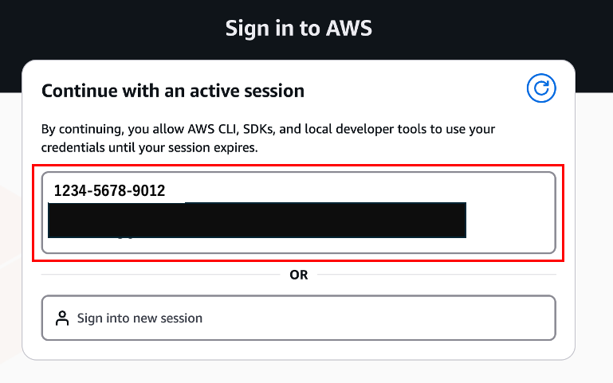
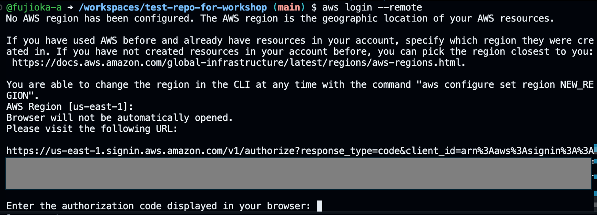

# template-aws-workshop-repository

[GitHubのCodespaces](https://github.co.jp/features/codespaces)を利用して、AWSワークショップ用の開発環境を構築するためのテンプレートリポジトリ

## 1. 開発環境の起動

1. ブラウザでGitHubにログインします。
2. このリポジトリ、またはこのリポジトリをテンプレートとして作成したリポジトリで、GitHubのCodespacesで開きます。（「Code」→「Codespaces」→「Create Codespace on main」をクリック）



Codespacesが開かれ、VS Codeが表示されれば起動成功です。

## 2. 開発環境のセットアップ

1. ターミナルを起動して、Makefileの実行、または適宜必要なツールをインストールしてください。

    Ex. AWS CLIのインストール

```bash
make install-aws
```

2. Codespaceとは別タブで、ワークショップを実施したいAWSアカウントで、マネジメントコンソールにログインしてください。

3. Codespaceのターミナルで以下コマンドを実行してください。

```bash
aws login --remote
```

4. ブラウザでログイン済みのアカウントが表示されるので、ワークショップを実施したいAWSアカウントを選択してください。



5. 「Copy verification code」をクリックして、コードをコピーしてください。

6. 表示されたコードをCodespaceのターミナルに入力してください。（以下のように表示されている状態のターミナルに対して、貼り付けてください。）



7. 接続が成功したことを確認するために以下コマンドを実行してください。

```bash
aws sts get-caller-identity
```

以下のように表示されれば、ターミナルからAWSへの接続が成功しています。

```bash
{
    "UserId": "{ユーザーID}",
    "Account": "{アカウントID}",
    "Arn": "arn:aws:iam::{アカウントID}:user/{ユーザー名}"
}
```

ここまでセットアップが完了すれば、CodespaceからAWSへのアクセスが可能な状態になっています。ワークショップを開始してください。

## 3. 開発環境の終了

念の為、Codespaceを終了する前に、AWSへの接続を切断してください。以下コマンドを実行してください。

```bash
aws logout
```

以上
